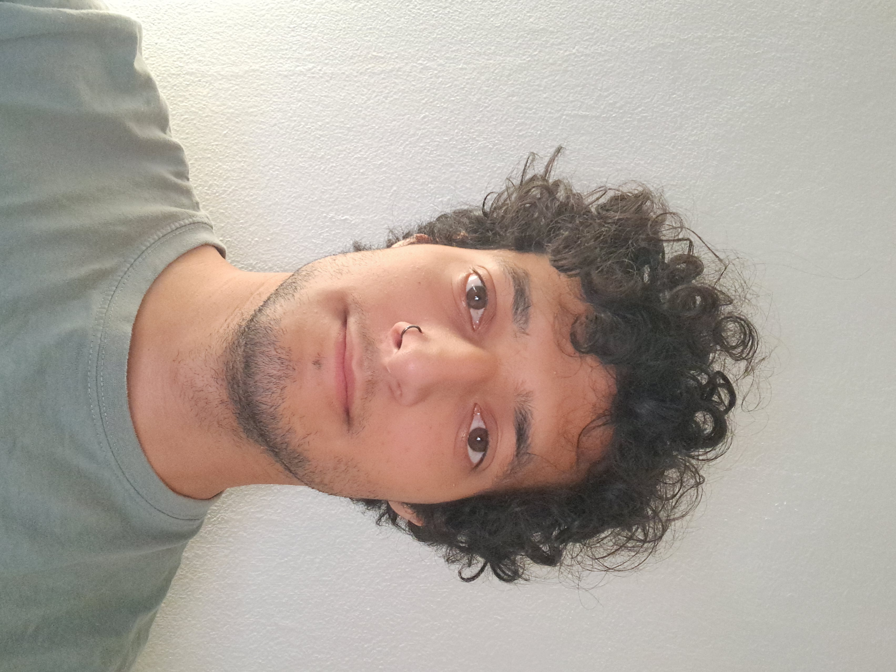

# My Graphic Design Manifesto

I believe everyone has a different style when it comes to graphic design. It mostly depends on their hobbies, drawing style, sense of humor, personality, and so on. In this manifesto, I want to show you my style and how my personality appears in graphic design. I’m not here to write about **“how to do graphic design correctly,”** because, for me, that question doesn’t exist. The most important thing for me is **creativity**.

I don’t think creativity has much to do with knowledge, but you can still practice it. But let’s start from the beginning: where does creativity come from? I’m not exactly sure which part of the human body it comes from—maybe the heart, the brain, or even hormones. But one thing I do know is that when I’m creative, I feel confident. There’s no room for questions like **“What if? Will they understand me? Is it good enough?”**

You have to trust yourself. If you don’t, then it’s not really you.

Another aspect of creativity is having a good environment (whatever that means for you). You need to feel comfortable because emotions flow through your creativity. So we can sum this up in one phrase: **a confident mindset.** And of course, all those emotions mixed with a confident mindset need a form, and that form is graphic design. Graphic design helps us transform our ideas and expressions into a unified form.

---

Now, let’s get to the question: how can we practice creativity, or do we even need to? I think a graphic designer needs to practice creativity every day. It’s like a muscle – the more you use it, the stronger it gets. And as you get older, you might find you have less creativity, which is why you need to keep exercising it. Unlike other fields, graphic designers don’t have specific exercises for creativity. For example, I’m also a musician, so I practice creativity through guitar improvisation, trying to connect it to well-phrased musical sentences. *Someone else might practice creativity by sketching in a notebook or creating their own Halloween makeup style.*

---

I’ve realized that music and graphic design have something in common. They’re created in a similar way. You can be technically skilled, but the reason people listen to you or look at your work is because you’re interesting, and they might not even know why, but they like what you’re doing. This is called the **“wow effect,”** and it’s just as important in graphic design as it is in music. Be interesting. Make something interesting. When I used to play in a band before moving to Prague, I was always **100% sure of everything I played**. The frontman would often say, **“I don’t know what you just played, bro, but it was freaking good, and I want it in the song!”**

---

But there’s another important factor to keep in mind: working with others. Understanding others and being on the same page is essential. Of course, there will be times when someone or something blocks your creativity. In those moments, remember that it’s a team project. In my opinion, there are two types of people: those who understand you but just want to do things their way – which is fine because they’ll eventually get it, even if they’re being stubborn. And then there are those who simply don’t understand what you’re trying to explain. If that’s the case, it probably means they’re in the wrong place and don’t belong in graphic design. They rush into things without listening.

**Never work on graphic design unless you're 100% sure of what you're doing.**

---

## My Approach to Graphic Design:

- Learning everything that excites me in this field
- Being creative
- Having a confident mindset
- Understanding others and being open to new opportunities

  ## **portfolio.md**

# Developer X - Portfólio

---

## **I’m [Your Name], a Web Developer**  

    Lorem ipsum dolor sit amet, consectetur adipiscing elit.  
    Quisque ullamcorper quam sit amet ornare consequat sed vitae tellus gravida.

[⬇ Scroll Down](#about-me)

---

## **Nice to meet you, I’m [Your Name]**  

    - **12+ Years of Experience**  
    - **150+ Successful Projects**

[Learn More](#portfolio)

---

## **About Me**

Lorem ipsum dolor sit amet, consectetur adipiscing elit. Quisque ullamcorper quam sit amet ornare consequat. Sed vitae tellus gravida.

    **My Work:**  
    Lorem ipsum dolor sit amet, consectetur adipiscing elit. Ut fringilla fermentum lacus non pellentesque.

[Browse Portfolio](#portfolio)

### **Follow Me:**  
[LinkedIn](#) | [Twitter](#) | [GitHub](#)

---

## **My Portfolio**

### **1️⃣ Project One**  
[View Project](project-one.md)  
Lorem ipsum dolor sit amet, consectetur adipiscing elit. Click to read more!

### **2️⃣ Project Two**  
[View Project](project-two.md)  
Mauris faucibus odio feugiat arcu scelerisque dictum. Dive deeper!

### **3️⃣ Project Three**  
[View Project](project-three.md)  
Sed do eiusmod tempor incididunt ut labore et dolore magna aliqua.

---

## **Contact Me**

### Get in Touch!

    📧 **Email:** [yourname@example.com](mailto:yourname@example.com)  
    💼 **LinkedIn:** [linkedin.com/in/yourname](#)  
    🖥️ **GitHub:** [github.com/yourname](#)  

    <strong>Let's create something amazing together!</strong>  
    <a href="mailto:yourname@example.com" style="background-color: #222; color: white; padding: 10px 20px; border-radius: 5px; text-decoration: none; transition: all 0.3s;" 
    onmouseover="this.style.backgroundColor='#555';" 
    onmouseout="this.style.backgroundColor='#222';">
        Send Me a Message
    </a>

---

### Project Details (Separate Pages)
Create a new Markdown file for each project, e.g., `project-one.md`:

# Project One

## Project Title: Amazing Website Redesign  

### **Project Description**  
Lorem ipsum dolor sit amet, consectetur adipiscing elit. Quisque ullamcorper quam sit amet ornare consequat sed vitae tellus gravida.

### **Technologies Used:**  
- HTML  
- CSS  
- JavaScript  

[Back to Portfolio](portfolio.md)

    I’m [Your Name], a Web Developer  
    Quisque ullamcorper quam sit amet ornare consequat sed vitae tellus gravida.

